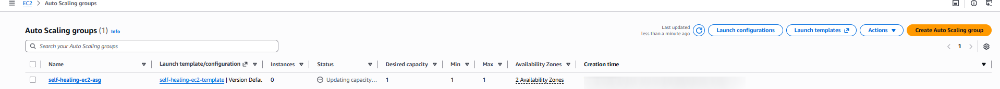

# Autoscaling group

In this step I will be creating and configuring the Auto Scaling Group, which will cover more than one Availability Zone (`us-east-1b` and `us-east-1a`). If one AZ goes down, my ASG automatically starts the replacement instance to make sure that the service is always available.

## Configuration steps:

In the EC2 dahsboard select ASG then Create. I will name a new ASG as `self-healing-ec2-asg` and template will be the one created in previous step `self-healing-ec2-template`, I will be using `default` vpc and select two subnets (`us-east-1b` and `us-east-1a`) and select Balance best effort for the availability zone distribution. Group size:

- Desired capacity: 1
- Minimum capacity: 1
- Maximum capacity: 1

Health check grace period will set 60 seconds.

