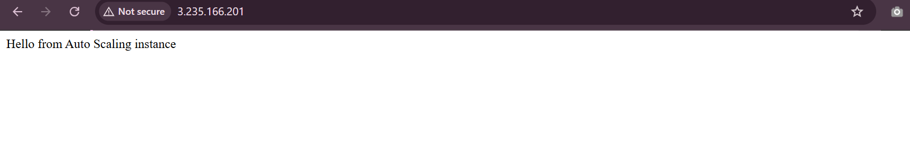

# Test Availability Zone Failure (AZ Replacement)

This implementation demonstartes how the Auto Scaling Group responds on the existing EC2 instance was running in an AZ is no longer allowed to use.

## Simulate the issue

To replicate an Availability Zone outage, I removed one subnet `us-east-1b` from the Auto Scaling Group `self-healing-ec2-asg`. The ASG automatically launches the replacement EC2 instance in the remaining healthy AZ `us-east-1a`, which demonstrating fault tolerance across multiple Availability Zones.

The current ec2 instance is running in `us-east-1b` and i need to remove that AZ from the Auto Scaling Group:

- I edit my ASG and in the Network I can see the two subnets: `us-east-1a` and `us-east-1b`. I'm going to remove the subnet that matches the instance’s AZ which is `us-east-1b` and only leave `us-east-1a`

I am going to monitor what Auto Scaling does: 

In my Auto Scaling Group select Activity Tab

- I can see ASG detects the instance is in an AZ it’s no longer allowed to use so it terminates that instance.
- I then see ASG immediately launches a new instance in the remaining AZ `us-east-1a`.

I can see a new instance by checking its Availability Zone as it should now be in the other AZ. In my case it's `us-east-1a` and a new PublicIP is `3.235.166.201`:

Veryfying in a browser:

## Summary

When multiple subnets (AZs) are configured, ASG automatically shifts capacity to any healthy AZ if one becomes unavailable.

The architecture remains available even if an entire Availability Zone goes down.
